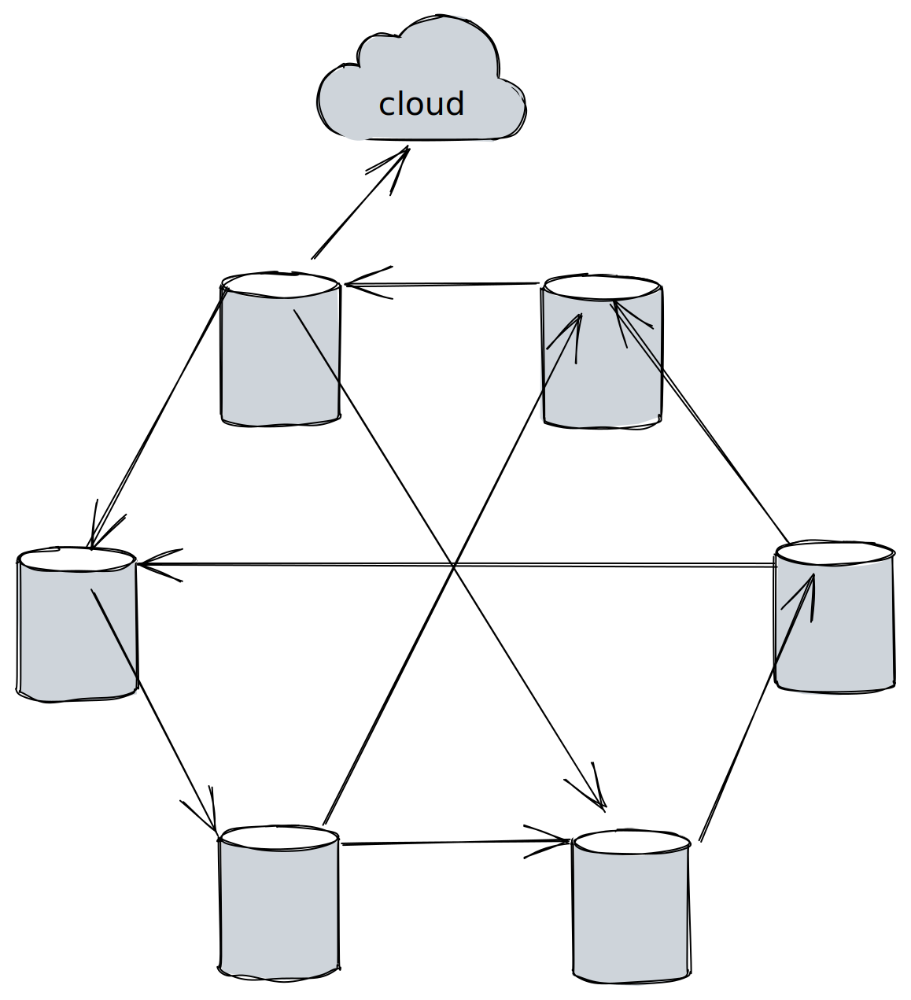

# Database
----
[](https://github.com/ellerbrock/open-source-badges/)
[](https://opensource.org/licenses/MIT)





<h2 align="center">Easiest way to sync data between all the device on your balena.io fleet </h2>

<h4 align="center">Great for collecting sensor data from temperature sensors, heat, water etc...</h4>

---


# Summary
### -  *[Installation](#Installation)*
### -  *[Deveopment](#For-developers)*
### -  *[Contributors](#Contributors)*
### -  *[Links](#Links)*
### -  *[License](#License)*


 
# Installation
### 
```bash
cd ~
git clone https://github.com/wisehackermonkey/database.git
cd database
```


 -----------------
# Screenshots
- <!--  -->


-----------------
# Development
### 
```bash
```


 
---
# Links
### 
### 
### 
### 
### 


 -----------------
# Contributors

[](https://github.com/wisehackermonkey/database/graphs/contributors)

##### Made with [contributors-img](https://contrib.rocks).

-----------------


# License

#### MIT © wisehackermonkey


[](https://opensource.org/licenses/MIT)
```bash
by oran collins
github.com/wisehackermonkey
oranbusiness@gmail.com
__DATE___
```
<!-- 

# Docker
### Build
```bash
cd ~
git clone https://github.com/wisehackermonkey/database.git
cd database
docker build -t wisehackermonkey/database:latest .  
```
### Run
```bash
docker run -it --rm --name wisehackermonkey/database:latest  
```
### Docker-compose
```bash
docker-compose build
docker-compose up 
```
# Publish Docker Image
```bash
docker build -t wisehackermonkey/database:latest .
docker login
docker push wisehackermonkey/database:latest
```
# Deploy on netlify
```
npm install netlify-cli -g
netlify login
netlify deploy
netlify deploy --prod
```
-->