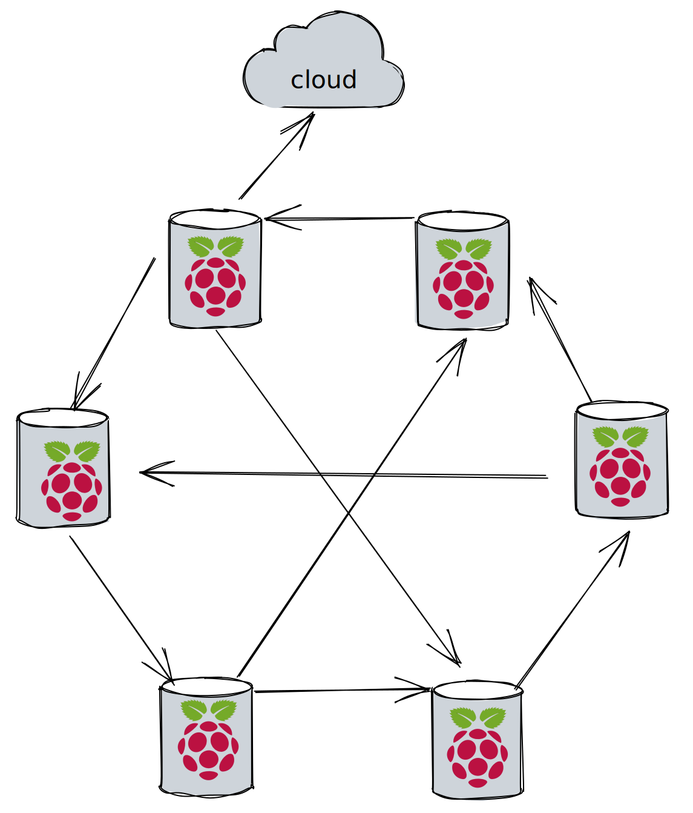

# Database
----
[](https://github.com/ellerbrock/open-source-badges/)
[](https://opensource.org/licenses/MIT)


<h2 align="center">DEPRICATED PROJECT not under development</h2>


<h2 align="center">Easiest way to sync data between all the device on your balena.io fleet </h2>

<h4 align="center">Great for collating sensor data from temperature sensors, heat, water etc...</h4>


---


# Summary
### -  *[Installation](#Installation)*
### -  *[Deveopment](#For-developers)*
### -  *[Contributors](#Contributors)*
### -  *[Links](#Links)*
### -  *[License](#License)*


 
# Installation
### 
```bash
cd ~
git clone https://github.com/wisehackermonkey/database.git
cd database

```


 -----------------
# Screenshots
- <!--  -->


-----------------
# Development
### 
```bash
cd ~
git clone https://github.com/wisehackermonkey/database.git
cd database/database
npm install
npm start
```
# Go to http://localhost:80/
### 
```bash
balena login
balena fleet
balena push <fleet name>
# example
balena push my-sensor-fleet

my fleet name is 'starter'
balena push starter
```


# ipfs install
[Command-line | IPFS Docs](https://docs.ipfs.io/install/command-line/#official-distributions)
```bash
wget https://dist.ipfs.io/go-ipfs/v0.12.0/go-ipfs_v0.12.0_linux-amd64.tar.gz
tar -xvzf go-ipfs_v0.12.0_linux-amd64.tar.gz
cd go-ipfs
sudo bash install.sh
ipfs --version

ipfs init
```


 
---
# Links
### 
### 
### 
### 
### 


 -----------------
# Contributors

[](https://github.com/wisehackermonkey/database/graphs/contributors)

##### Made with [contributors-img](https://contrib.rocks).

-----------------


# License

#### MIT © wisehackermonkey


[](https://opensource.org/licenses/MIT)
```bash
by oran collins
github.com/wisehackermonkey
oranbusiness@gmail.com
20220308
```
<!-- 

# Docker
### Build
```bash
cd ~
git clone https://github.com/wisehackermonkey/database.git
cd database
docker build -t wisehackermonkey/database:latest .  
```
### Run
```bash
docker run -it --rm --name wisehackermonkey/database:latest  
```
### Docker-compose
```bash
docker-compose build
docker-compose up 
```
# Publish Docker Image
```bash
docker build -t wisehackermonkey/database:latest .
docker login
docker push wisehackermonkey/database:latest
```
# Deploy on netlify
```
npm install netlify-cli -g
netlify login
netlify deploy
netlify deploy --prod
```
-->

# Blog post starter
# TITLE:  Balena Database: My adventures in adding a Distributed Database for collecting sensor data 
# TL;DR
TODO
### 
# Background:
I've been following the developments of IPFS for the past 2-3ish years. and wanted to add it to one my future projects. Collecting sensor data from a bunch of raspberry pi's, in a offline way. seemed like a good fit.


Why this project would be helpful?
Imaging your setting up a new fleet of 10x RPI4's with temperature sensors, and you need a quick way to collect all the data from all the sensors streaming data in from the sensors. And you don't feel like setting up a full scale database, or the complexities of a cloud database.
Ideally this would be as easy as adding something that looks like this to your docker file
```
  dashboard:
    image: balenablocks/database:raspberrypi4
    restart: always
    volumes:
        - 'database-data:/data'
```
##### Note this is an idea of what it would look like

# The Problem:
Grab sensor data from 2-to- thousands of devices, in a offline first way, with minimal to no setup.

## What is IPFS?
TODO
## What are distributed databases?
`a database in which data is stored across different physical locations.[1] It may be stored in multiple computers located in the same physical location (e.g. a data centre); or maybe dispersed over a network of interconnected computers.`  - [Distributed Database: Wikipedia](https://en.wikipedia.org/wiki/Distributed_database)

## Why are they important for this problem:
TODO

# Solution:
TODO
# Trail #1 Defining the problem
Which database software should I use? Orbit db or Gun.js db?
TODO

# Open questions:
TODO
Link to github repo:
TODO

Todos:
20220314
- get a balena blocks sample project that uses the connector block
- Run through a getting started with IPFS tutorial
- send link of this post to the IPFS and Orbis DB community for addtional throughs and help
-